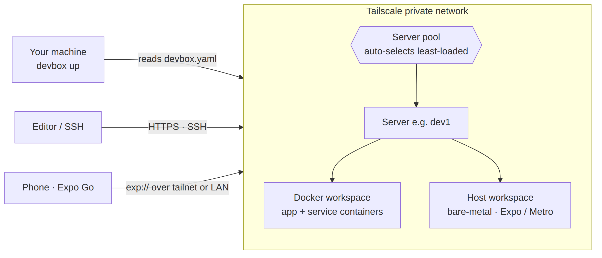

<div align="center">

# devbox

**Turn any Linux machine into a ready-to-use, remote dev environment — in one command.**

No cloud lock-in, no Kubernetes, no DevOps. Just Docker for isolation and Tailscale for secure networking.

[](LICENSE)
[](go.mod)
[](#install)
[](#install)

[Quick Start](#quick-start) · [Install](#install) · [Commands](#commands) · [Mobile Preview](#mobile-preview-expo--react-native) · [Docs](https://junixlabs.github.io/devbox)

</div>

---

devbox takes any Linux box — an old desktop, a mini-PC, a cheap VPS — and makes it a fully provisioned development environment you can reach securely from anywhere. Point it at a project, run `devbox up`, and you get isolated containers, an HTTPS URL, and SSH access wired through your private Tailscale network.

## How it works

<p align="center">
  
</p>

1. **`devbox up`** reads `devbox.yaml` and picks a server from your pool (or the one you name).
2. It provisions a **workspace** on that server — **Docker containers** (default, isolated) or a **bare-metal host runtime** (for mobile / native tooling).
3. Ports are exposed over your **private Tailscale network** — automatic HTTPS + MagicDNS, nothing public.
4. You connect: your **editor or SSH** to the workspace; a **phone** to an Expo/Metro mobile preview.

## Why devbox?

| | Managed | Self-hosted | Free | Simple |
|---|:---:|:---:|:---:|:---:|
| **GitHub Codespaces** | ✅ | ❌ | ❌ ($40–80/dev/mo) | ✅ |
| **Coder** | ❌ | ✅ | ✅ | ❌ (needs Kubernetes) |
| **DevPod** | ❌ | ✅ | ✅ | ⚠️ (abandoned 2024) |
| **devbox** | ❌ | ✅ | ✅ | ✅ |

Bring your own hardware. devbox handles the rest.

## Features

**🚀 Core**
- **One-command workspaces** — `devbox up` clones your repo, starts containers, and exposes ports
- **Docker isolation** — every workspace gets its own containers and resource limits (CPU/memory)
- **Tailscale networking** — automatic HTTPS, MagicDNS, and access control; nothing exposed to the public internet
- **Server pool** — register multiple servers; devbox auto-selects the least-loaded one
- **Multi-workspace** — run parallel environments for different branches, users, or AI agents (user-scoped naming + isolation)

**🧰 Productivity**
- **8 built-in templates** + a community **template registry** (`search` / `pull` / `push`)
- **Interactive TUI dashboard** — browse workspaces and tail logs with keyboard navigation
- **Snapshots & restore** — capture and roll back workspace state (compressed volume archives)
- **Live metrics** — per-workspace CPU, memory, disk, and network I/O via `devbox stats`
- **Health checks** — `devbox doctor` validates server prerequisites
- **Import `docker-compose.yml`** — `devbox init --from-compose`

**🔌 Extensibility & automation**
- **Plugin system** — extend devbox with custom providers and hooks
- **CI/CD PR previews** — spin up throwaway preview workspaces from GitHub Actions
- **Machine-readable output** — `--json` on `up`/`list` returns structured `{status, connectUrl, qr, mode}` so tools and AI agents can orchestrate devbox over the CLI

**📱 Mobile preview (Expo / React Native)**
- **Bare-metal `host` runtime** for native tooling (Android SDK/emulator, USB, Metro) that Docker can't provide
- **Metro over Tailscale** — a phone on your tailnet connects directly, no relay; `--tunnel` fallback for off-tailnet devices
- **Refresh-on-branch** and **EAS Android builds** — see [Mobile Preview](#mobile-preview-expo--react-native)

## Quick start

```bash
# 1. Verify your server is ready (Docker + Tailscale reachable)
devbox doctor --server dev1

# 2. Create a config in your project
devbox init

# 3. Start a workspace
devbox up

# 4. Connect
devbox ssh my-project
```

See the [Quick Start Guide](https://junixlabs.github.io/devbox/getting-started/quickstart/) for a detailed walkthrough.

## Install

### Download the binary

```bash
# Linux (amd64)
curl -fsSL https://github.com/junixlabs/devbox/releases/latest/download/devbox-linux-amd64 -o devbox
chmod +x devbox && sudo mv devbox /usr/local/bin/

# Linux (arm64)      → devbox-linux-arm64
# macOS (Apple)      → devbox-darwin-arm64
# macOS (Intel)      → devbox-darwin-amd64
```

### Build from source

```bash
git clone https://github.com/junixlabs/devbox.git
cd devbox
make build
sudo mv dist/devbox /usr/local/bin/
```

Requires **Go 1.25+**.

## Commands

**Workspace lifecycle**

| Command | Description |
|---------|-------------|
| `devbox init` | Create a `devbox.yaml` (interactive, `--template`, or `--from-compose`) |
| `devbox up [project]` | Create and start a workspace (`--branch`, `--server`, `--template`, `--json`, `--build`) |
| `devbox list` | List workspaces (`--all`, `--json`) |
| `devbox stop <workspace>` | Stop a workspace without destroying it |
| `devbox destroy <workspace>` | Permanently remove a workspace |
| `devbox ssh <workspace>` | SSH into a workspace |
| `devbox logs <workspace>` | View / follow workspace logs |

**Fleet & operations**

| Command | Description |
|---------|-------------|
| `devbox server add\|remove\|list` | Manage the server pool |
| `devbox tui` | Open the interactive dashboard |
| `devbox stats [workspace]` | Show live resource usage |
| `devbox doctor [--server name]` | Check prerequisites and server health |

**Workspaces at scale**

| Command | Description |
|---------|-------------|
| `devbox template list\|create\|search\|pull\|push` | Manage & share workspace templates |
| `devbox snapshot` / `devbox restore` | Snapshot and restore workspace state |
| `devbox plugin` | Manage plugins |
| `devbox ci preview-up\|preview-down` | CI/CD PR preview workspaces |

## Configuration

A project's `devbox.yaml` describes its workspace. Minimal example:

```yaml
name: my-app                 # required — workspace name / Tailscale hostname
server: dev1                 # required — target server (SSH + Tailscale)
repo: git@github.com:acme/my-app.git
branch: main

services:                    # sidecar containers (Docker runtime)
  - postgres:16
  - redis:7-alpine

ports:                       # exposed to your machine via Tailscale
  app: 3000
  postgres: 5432

env:
  APP_ENV: local
  DATABASE_URL: postgres://postgres@postgres:5432/app
```

See the [Configuration Reference](https://junixlabs.github.io/devbox/getting-started/config/) for every field, and [`devbox.yaml.example`](devbox.yaml.example).

### Built-in templates

`django` · `go` · `laravel` · `nextjs` · `python` · `rails` · `rust` · `expo`

```bash
devbox init --template nextjs     # scaffold a devbox.yaml from a template
devbox template list              # see all available templates
```

## Mobile preview (Expo / React Native)

devbox can act as a **mobile preview target**: serve an Expo/React Native branch to a real device over your tailnet, with automatic escalation to a native build. This uses the bare-metal **`host` runtime** instead of Docker, so the workspace has direct access to the Android SDK, emulators, USB, and Metro.

```yaml
name: my-mobile-app
server: mac-mini
runtime: host                # run setup/serve directly on the host (no container)
repo: git@github.com:acme/my-mobile-app.git
setup:
  - npm ci
serve: expo start            # long-lived process kept alive by devbox
ports:
  metro: 8081
  expo: 19000
env:
  EXPO_PUBLIC_API_URL: https://staging.api.acme.dev
  EAS_TOKEN: "…"             # for --build
```

```bash
devbox up                    # serve Metro; a phone on the tailnet connects directly
devbox up --json             # → { "status", "connect_url": "exp://…:8081", "qr", "mode" }
devbox up                    # re-run to sync a new branch (fast-refresh, or rebuild on native change)
devbox up --build            # run an EAS Android build → installable artifact URL + QR
```

- **Direct connect** — devbox advertises the box's Tailscale MagicDNS hostname to Metro, so a device on the same tailnet loads the bundle with no Expo relay. Off-tailnet devices fall back to `expo start --tunnel`.
- **Refresh-on-branch** — re-running `up` git-fetches the requested branch and hot-reloads; it rebuilds only when the diff touches native code or lockfiles.
- **EAS builds** — `--build` runs `eas build` for Android and returns the install link (iOS requires a macOS host — out of scope for a Linux box).

> The `--json` output (connect URL, QR, status) is the machine-readable contract for orchestrators such as Forge — no log scraping required.

## Prerequisites

- A Linux server (Ubuntu 22.04+ recommended) reachable via SSH
- [Docker](https://docs.docker.com/engine/install/) on the server (for the default `docker` runtime)
- [Tailscale](https://tailscale.com/download) on both your machine and the server

## Documentation

**[https://junixlabs.github.io/devbox](https://junixlabs.github.io/devbox)**

- [Quick Start Guide](https://junixlabs.github.io/devbox/getting-started/quickstart/) — install to `devbox up` in 15 minutes
- [Configuration Reference](https://junixlabs.github.io/devbox/getting-started/config/) — every `devbox.yaml` field
- [Developer Guide](https://junixlabs.github.io/devbox/guides/developer/) — daily workflow, templates, snapshots
- [Mobile Preview (Expo)](https://junixlabs.github.io/devbox/guides/mobile-preview-android/) — serve an Expo app to a device over Tailscale/LAN, EAS builds
- [Admin Guide](https://junixlabs.github.io/devbox/guides/admin/) — server pools, user isolation, monitoring
- [Plugin API](https://junixlabs.github.io/devbox/reference/plugin-api/) — custom providers and hooks
- [Troubleshooting](https://junixlabs.github.io/devbox/reference/troubleshooting/) · [FAQ](https://junixlabs.github.io/devbox/reference/faq/)

## License

[MPL-2.0](LICENSE)
